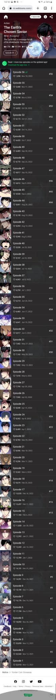

# Procesverslag
Markdown is een simpele manier om HTML te schrijven.  
Markdown cheat cheet: [Hulp bij het schrijven van Markdown](https://github.com/adam-p/markdown-here/wiki/Markdown-Cheatsheet).

Nb. De standaardstructuur en de spartaanse opmaak van de README.md zijn helemaal prima. Het gaat om de inhoud van je procesverslag. Besteedt de tijd voor pracht en praal aan je website.

Nb. Door *open* toe te voegen aan een *details* element kun je deze standaard open zetten. Fijn om dat steeds voor de relevante stuk(ken) te doen.

## Jij

  
uitwerken voor kick-off werkgroep

  ### Auteur:
  Aaminah Basnoe

  #### Je startniveau:
  blauw/rood

  #### Je focus:
  surface plane
 

## Je website

  
uitwerken voor kick-off werkgroep

  ### Je opdracht:
  Desktop website: https://www.webtoons.com/en/ 
  Mobiele versie: https://m.webtoons.com/en/?webtoon-platform-redirect=true 

  #### Screenshot(s) van de eerste pagina (small screen): 
  hier de naam van de pagina  
  

  #### Screenshot(s) van de tweede pagina (small screen):
  hier de naam van de pagina  
  
 

## Toegankelijkheidstest 1/2 (week 1)

  
uitwerken na test in 1e werkgroep

  ### Bevindingen
  Lijst met je bevindingen die in de test naar voren kwamen:

  #### Screenreader
  Hier korte omschrijving (met indien nodig afbeeldingen)

    Ik heb de screenreader gebruikt op de website die ik ga namaken. De screenreader is over het algemeen wel makkelijk te gebruiken. Alleen viel het mij op dat sommige kopjes 2 keer worden gezegd. Dat kan best irritant zijn. 

  Hier een omschrijving van hoe het opgelost kan worden (met indien nodig afbeeldingen)

    Waarschijnlijk zegt de screenreader sommige kopjes 2 keer, omdat er een alt tekst staat. Misschien is er een functie waarmee je tegen de screenreader kan zeggen om alleen de alt teksten te lezen. 

  #### Muis en Toetsenbord 
  Hier korte omschrijving (met indien nodig afbeeldingen)

  Hier een omschrijving van hoe het opgelost kan worden (met indien nodig afbeeldingen)

  #### Motoriek (shocks, elastiekjes)
  Hier korte omschrijving (met indien nodig afbeeldingen)

    Ik heb met verschillende beperkingen de website getest. Ik heb geprobeerd de site te gebruiken terwijl 

  Hier een omschrijving van hoe het opgelost kan worden (met indien nodig afbeeldingen)

  #### Visueel (brillen, contrast, kleurenblind, dark/light). 
  Hier korte omschrijving (met indien nodig afbeeldingen)

  Hier een omschrijving van hoe het opgelost kan worden (met indien nodig afbeeldingen)

## Breakdownschets (week 1)

  
uitwerken na afloop 2e werkgroep

  ### de hele pagina: 
  

  ### dynamisch deel (bijv menu): 
  

  ### wellicht nog een dynamisch deel (bijv filter): 
  

## Voortgang 1 (week 2)

  
uitwerken voor 1e voortgang

  ### Stand van zaken
  hier dit ging goed & dit was lastig (neem ook screenshots op van delen van je website en code)
  
  De lessen gaan tot nu toe wel goed. Ik begrijp de stof redelijk goed en maak veel aantekeningen. Het is wel zo dat ik het in de les vaak allemaal wel snap, maar wanneer ik het dan zelf in mijn eigen website moet toepassen, vind ik het nog wel lastig. Ik ben nog niet zo ver met mijn code. Ik heb nu de html, maar nog geen css. De HTML is naar mijn idee wel goed gegaan, alleen twijfel ik nog of sommige delen wel kloppen. 

  

  ### Agenda voor meeting
  samen met je groepje opstellen

  | Aaminah      | Sjors          | Nada    | Jesse        |
  | ---            | ---                | ---          | ---              |
  | Ik wil graag bespreken of het eerste gedeelte van mijn html in orde is. |  Ik zou graag willen weten of er een tijdschema is voor de website, of dat we zelf volledig het tempo bepalen.            | ik zou graag willen weten hoe je uitklapbare footer kan maken     | en dan ik dat    |
  | Ik weet nog niet helemaal hoe het bovenste gedeelte van de 2e pagina in elkaar zit kwa html.  | dit als er tijd is | nog een punt | dit wil ik zeker |
  | Ik wil iets laten scrollen, maar de srollbar moet niet zichtbaar zijn. Ook wil ik graag weten hoe ik een timer op een carousel/slider kan zetten met een counter erbij.            | ...                | ...          | ...              |

  ### Verslag van meeting
  hier na afloop snel de uitkomsten van de meeting vastleggen

  - Alt leegtalen bij de emoji's (ipv daarvan een aria label)
  - Je mag dingen kopiëren met mate (met de bronvermelding erbij ofc)
  - Section 2 is een grid met een media query (zie code op teams).
  - 

## Voortgang 2 (week 3)

  
uitwerken voor 2e voortgang

  ### Stand van zaken
  hier dit ging goed & dit was lastig (neem ook screenshots op van delen van je website en code)

  Ik ben veel vooruit gekomen sinds het vorige voortgangsgesprek. Ik heb de eerste pagina (de homepagina) bijna af. Aan de tweede pagina moet ik nog beginnen. Mijn CSS is wel nog wat slordig. Hier ga ik later aan zitten en alles netjes gestructureerd neerzetten en alle code in commentaar weghalen. Aan mijn javascript ben ik ook nog niet begonnen. Verder moet ik ook nog goed kijken naar de dingen die ik wil toevoegen voor de surface plane. Tot nu toe gaat het coderen best wel goed. Ik snap wat ik doe en weet ongeveer wel hoe ik verder moet. Wel twijfel ik nog steeds of ik dingen soms wel op de juiste manier doe. 

  ### Agenda voor meeting
  samen met je groepje opstellen

  | Aaminah      | Nada          | Sjors    | student 4        |
  | ---            | ---                | ---          | ---              |
  | Ik wil graag weten hoe ik een infinite slider kan maken met een timer en een counter die laat zien welke img van de slider te zien is  | Ik wil graag weten hoe ik een uitklap footer maak             | Ik zou graag willen weten of de HTML van mijn navigatie semantisch correct is    | en dan ik dat    |
  |  Ik wil graag weten hoe je een scrollbar weghaald | Ik wil  weten hoe ik plaatjes naast elkaar krijg en responsive is | nog een punt | dit wil ik zeker |
  | Ik wil graag weten hoe je een stuk tekst halverwege kan laten stoppen en meer tekst laat zien wanneer het scherm groter wordt            | ...                | ...          | ...              |

  ### Verslag van meeting
  hier na afloop snel de uitkomsten van de meeting vastleggen

section: overflow hidden

ul: 
position relative
margin 0
padding 0
height: em
overflow hidden

li:
position absolute
height width 100%
top 0
left 0
animation: slider 8s infinite linear

li:nth of type(1):
animation-delay: -3s;

a:
widht 100%
height 100%
display block

img:
display block
height wift 100 %
object-fit: cover

li 

@keyframes slider{
  0%, 12,5%{
    transform: translateX(100%);
  }

  25%{
    transform: translateX(0%);
  }

  37,5%{
    transform: translateX(0%);
  }

  50%{
    transform: translateX(-100%);
  }

  100%{
    transform: translateX(-100%);
  }

}

text-overflow: elipsus

  - punt 1
  - punt 2
  - nog een punt
- ...

## Toegankelijkheidstest 2/2 (week 4)

  
uitwerken na test in 8e werkgroep

  ### Bevindingen
  Lijst met je bevindingen die in de test naar voren kwamen (geef ook aan wat er verbeterd is):

  #### Screenreader
  Hier korte omschrijving (met indien nodig afbeeldingen)

  Hier een omschrijving van hoe het opgelost kan worden (met indien nodig afbeeldingen)

  #### Muis en Toetsenbord 
  Hier korte omschrijving (met indien nodig afbeeldingen)

  Hier een omschrijving van hoe het opgelost kan worden (met indien nodig afbeeldingen)

  #### Motoriek (shocks, elastiekjes)
  Hier korte omschrijving (met indien nodig afbeeldingen)

  Hier een omschrijving van hoe het opgelost kan worden (met indien nodig afbeeldingen)

  #### Visueel (brillen, contrast, kleurenblind, dark/light). 
  Hier korte omschrijving (met indien nodig afbeeldingen)

  Hier een omschrijving van hoe het opgelost kan worden (met indien nodig afbeeldingen)

## Voortgang 3 (week 4)

  
uitwerken voor 3e voortgang

  ### Stand van zaken
  hier dit ging goed & dit was lastig (neem ook screenshots op van delen van je website en code)

  ### Agenda voor meeting
  samen met je groepje opstellen

  | student 1      | student 2          | student 3    | student 4        |
  | ---            | ---                | ---          | ---              |
  | dit bespreken  | en dit             | en ik dit    | en dan ik dat    |
  | en dat ook nog | dit als er tijd is | nog een punt | dit wil ik zeker |
  | ...            | ...                | ...          | ...              |

  ### Verslag van meeting
  hier na afloop snel de uitkomsten van de meeting vastleggen

  - punt 1
  - punt 2
  - nog een punt
  - ...

## Eindgesprek (week 5)

  
uitwerken voor eindgesprek

  ### Je uitkomst - karakteristiek screenshots:
  

  ### Dit ging goed/Heb ik geleerd: 
  Korte omschrijving met plaatjes

  

  ### Dit was lastig/Is niet gelukt:
  Korte omschrijving met plaatjes

  

## Bronnenlijst

  
continu bijhouden terwijl je werkt

  Nb. Wees specifiek ('css-tricks' als bron is bijv. niet specifiek genoeg).

  1. bron 1
  2. bron 2
  3. ...

