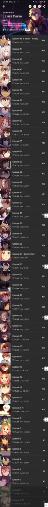

# Procesverslag
Markdown is een simpele manier om HTML te schrijven.  
Markdown cheat cheet: [Hulp bij het schrijven van Markdown](https://github.com/adam-p/markdown-here/wiki/Markdown-Cheatsheet).

Nb. De standaardstructuur en de spartaanse opmaak van de README.md zijn helemaal prima. Het gaat om de inhoud van je procesverslag. Besteedt de tijd voor pracht en praal aan je website.

Nb. Door *open* toe te voegen aan een *details* element kun je deze standaard open zetten. Fijn om dat steeds voor de relevante stuk(ken) te doen.

## Jij

  
uitwerken voor kick-off werkgroep

  ### Auteur:
  Aaminah Basnoe

  #### Je startniveau:
  blauw/rood

  #### Je focus:
  surface plane
 

## Je website

  
uitwerken voor kick-off werkgroep

  ### Je opdracht:
  Desktop website: https://www.webtoons.com/en/ 
  Mobiele versie: https://m.webtoons.com/en/?webtoon-platform-redirect=true 

  #### Screenshot(s) van de eerste pagina (small screen): 
  hier de naam van de pagina  
  

  #### Screenshot(s) van de tweede pagina (small screen):
  hier de naam van de pagina  
  
 

## Toegankelijkheidstest 1/2 (week 1)

  
uitwerken na test in 1e werkgroep

  ### Bevindingen
  Lijst met je bevindingen die in de test naar voren kwamen:

  #### Screenreader
  Hier korte omschrijving (met indien nodig afbeeldingen)

  Ik heb de screenreader gebruikt op de website die ik ga namaken. De screenreader is over het algemeen wel makkelijk te gebruiken. Alleen viel het mij op dat sommige kopjes 2 keer worden gezegd. Dat kan best irritant zijn. 

  Hier een omschrijving van hoe het opgelost kan worden (met indien nodig afbeeldingen)

  Waarschijnlijk zegt de screenreader sommige kopjes 2 keer, omdat er een alt tekst staat. Misschien is er een functie waarmee je tegen de screenreader kan zeggen om alleen de alt teksten te lezen. (Of misschien een hele andere manier)

  #### Muis en Toetsenbord 
  Hier korte omschrijving (met indien nodig afbeeldingen)
  - Er zijn niet overal hoverstates. 
  - De focus state van de slider werkt niet goed, want als je tabt, gaat de slider gewoon door dus hij blijft niet staan.

  Hier een omschrijving van hoe het opgelost kan worden (met indien nodig afbeeldingen)
  - Misschien dat je ergens in javascript of css kan zeggen dat het plaatje moet blijven staan als je erop tabt of erover heen hovert. Hoe dit precies moet weet ik niet.s

  #### Motoriek (shocks, elastiekjes)
  Hier korte omschrijving (met indien nodig afbeeldingen)

  Ik heb met verschillende beperkingen de website getest. De site is prima te gebruiken met elastiekjes. Met shocks is het iets moeilijk, omdat sommige linkjes nog wat klein zijn.

  Hier een omschrijving van hoe het opgelost kan worden (met indien nodig afbeeldingen)
  Je kan de hover state groter maken, zodat je beter kan klikken, maar dat de knoppen niet constant zo groot zijn.

  #### Visueel (brillen, contrast, kleurenblind, dark/light). 
  Hier korte omschrijving (met indien nodig afbeeldingen)
  De site is over het algemeen nog wel goed te gebruiken, alleen bijvoorbeeld bij de blur zie je eigenlijk niks meer. Het contrast is bij sommige delen van de site te laag.

  Hier een omschrijving van hoe het opgelost kan worden (met indien nodig afbeeldingen)
  Je kan andere kleuren gebruiken met een hoger contrast.

## Breakdownschets (week 1)

  
uitwerken na afloop 2e werkgroep

  ### de hele pagina: 
  

  ### dynamisch deel (bijv menu): 
  

  ### wellicht nog een dynamisch deel (bijv filter): 
  

## Voortgang 1 (week 2)

  
uitwerken voor 1e voortgang

  ### Stand van zaken
  hier dit ging goed & dit was lastig (neem ook screenshots op van delen van je website en code)
  
  De lessen gaan tot nu toe wel goed. Ik begrijp de stof redelijk goed en maak veel aantekeningen. Het is wel zo dat ik het in de les vaak allemaal wel snap, maar wanneer ik het dan zelf in mijn eigen website moet toepassen, vind ik het nog wel lastig. Ik ben nog niet zo ver met mijn code. Ik heb nu de html, maar nog geen css. De HTML is naar mijn idee wel goed gegaan, alleen twijfel ik nog of sommige delen wel kloppen. 

  

  ### Agenda voor meeting
  samen met je groepje opstellen

  | Aaminah      | Sjors          | Nada    | Jesse        |
  | ---            | ---                | ---          | ---              |
  | Ik wil graag bespreken of het eerste gedeelte van mijn html in orde is. |  Ik zou graag willen weten of er een tijdschema is voor de website, of dat we zelf volledig het tempo bepalen.            | ik zou graag willen weten hoe je uitklapbare footer kan maken     | en dan ik dat    |
  | Ik weet nog niet helemaal hoe het bovenste gedeelte van de 2e pagina in elkaar zit kwa html.  | dit als er tijd is | nog een punt | dit wil ik zeker |
  | Ik wil iets laten scrollen, maar de srollbar moet niet zichtbaar zijn. Ook wil ik graag weten hoe ik een timer op een carousel/slider kan zetten met een counter erbij.            | ...                | ...          | ...              |

  ### Verslag van meeting
  hier na afloop snel de uitkomsten van de meeting vastleggen

  - Alt leegtalen bij de emoji's (ipv daarvan een aria label)
  - Je mag dingen kopiëren met mate (met de bronvermelding erbij ofc)
  - Section 2 is een grid met een media query (zie code op teams).
  - 

## Voortgang 2 (week 3)

  
uitwerken voor 2e voortgang

  ### Stand van zaken
  hier dit ging goed & dit was lastig (neem ook screenshots op van delen van je website en code)

  Ik ben veel vooruit gekomen sinds het vorige voortgangsgesprek. Ik heb de eerste pagina (de homepagina) bijna af. Aan de tweede pagina moet ik nog beginnen. Mijn CSS is wel nog wat slordig. Hier ga ik later aan zitten en alles netjes gestructureerd neerzetten en alle code in commentaar weghalen. Aan mijn javascript ben ik ook nog niet begonnen. Verder moet ik ook nog goed kijken naar de dingen die ik wil toevoegen voor de surface plane. Tot nu toe gaat het coderen best wel goed. Ik snap wat ik doe en weet ongeveer wel hoe ik verder moet. Wel twijfel ik nog steeds of ik dingen soms wel op de juiste manier doe. 

  ### Agenda voor meeting
  samen met je groepje opstellen

  | Aaminah      | Nada          | Sjors    | student 4        |
  | ---            | ---                | ---          | ---              |
  | Ik wil graag weten hoe ik een infinite slider kan maken met een timer en een counter die laat zien welke img van de slider te zien is  | Ik wil graag weten hoe ik een uitklap footer maak             | Ik zou graag willen weten of de HTML van mijn navigatie semantisch correct is    | en dan ik dat    |
  |  Ik wil graag weten hoe je een scrollbar weghaald | Ik wil  weten hoe ik plaatjes naast elkaar krijg en responsive is | nog een punt | dit wil ik zeker |
  | Ik wil graag weten hoe je een stuk tekst halverwege kan laten stoppen en meer tekst laat zien wanneer het scherm groter wordt            | ...                | ...          | ...              |

  ### Verslag van meeting
  hier na afloop snel de uitkomsten van de meeting vastleggen

  - Gebruik van keyframes, animaties
  - Slider moet niet in desplay flex
  - Counter moet met Javascript
  - Text-overflow: ellipsus
  - overflow hidden gebruiken

## Toegankelijkheidstest 2/2 (week 4)

  
uitwerken na test in 8e werkgroep

  ### Bevindingen
  Lijst met je bevindingen die in de test naar voren kwamen (geef ook aan wat er verbeterd is):

  #### Screenreader
  Hier korte omschrijving (met indien nodig afbeeldingen)
  
  - Plaatjes worden overgeslagen
  - In de header zegt de screenreader alleen ''koppeling'. 

  Hier een omschrijving van hoe het opgelost kan worden (met indien nodig afbeeldingen)
 - alt teksten of aria lables geven aan de images.
  

  

  #### Muis en Toetsenbord 
  Hier korte omschrijving (met indien nodig afbeeldingen)

  - bij de 'genre' section en in de slider is de hoverstate niet goed zichtbaar. 
  -  focus en hover moet nog toegevoegd worden.

  Hier een omschrijving van hoe het opgelost kan worden (met indien nodig afbeeldingen)
  - Hover, focus en active states toevoegen.

 

  #### Motoriek (shocks, elastiekjes)
  Hier korte omschrijving (met indien nodig afbeeldingen)
  - footer wordt moeilijker klikbaar
  - Sommige knoppen zijn te klein

  Hier een omschrijving van hoe het opgelost kan worden (met indien nodig afbeeldingen)
  - grote knoppen maken
  - De hover groter maken

  #### Visueel (brillen, contrast, kleurenblind, dark/light). 
  Hier korte omschrijving (met indien nodig afbeeldingen)

  bril: combined loss diabetic eye disease 
  de h3tjes zijn niet heel goed zichtbaar, te klein en te dun

  bril: low contrast
  kleine kopjes/tekst is moeilijk te lezen. de button 'download' is niet heel goed zichtbaar door het lage contrast.

  bril: peripheral field loss
  vierde section wordt moeilijk zichtbaar

  bril: Kleurenblind
  alles is nog prima zichtbaar

  Hier een omschrijving van hoe het opgelost kan worden (met indien nodig afbeeldingen)

  - hoger contrast geven
  - knop voor groter lettertype
  - dark light mode maken

  

## Voortgang 3 (week 4)

  
uitwerken voor 3e voortgang

  ### Stand van zaken
  hier dit ging goed & dit was lastig (neem ook screenshots op van delen van je website en code)

  De eerste pagina lijkt nu best wel op die van de site. Het gehele surface plane gedeelte moet ik wel nog doen. De states moet ik ook nog toevoegen. De html van de 2e pagina is nog niet helemaal af, maar dat is een kwestie van knippen en plakken en de content veranderen, dus dat moet goed komen. Met de styling van de 2e pagina ben ik nog niet zo heel ver. 

  Ik ben wel trots op hoe de homepagina eruit ziet. Het ziet er netjes uit. De slider is echter nog niet gelukt. Ik heb meerdere dingen geprobeerd, maar ik ben er nog steeds niet uitgekomen.  

  ### Agenda voor meeting
  samen met je groepje opstellen

  | Aaminah      | Nada          | student 3    | student 4        |
  | ---            | ---                | ---          | ---              |
  | Ik wil weten hoe je een infinite carousel maakt met een timer en counter.  | Ik wil graag weten hoe je een responsive grid maakt en hoe je het beste de breedte bepaald van de kolommen.             | en ik dit    | en dan ik dat    |
  | Ik wil weten hoe je een sticky achtergrond maakt over de hele pagina  | dit als er tijd is | nog een punt | dit wil ik zeker |
  | ...            | ...                | ...          | ...              |

  ### Verslag van meeting
  hier na afloop snel de uitkomsten van de meeting vastleggen

  - Sticky achtergrond gemaakt.
  - Slider moet met javascript.
  - Css display grid gebruiken, 1 in beeld laten en eentje links en rechts een class geven, met javascript de animatie activeren. Draggable maken in javascript. 

## Eindgesprek (week 5)

  
uitwerken voor eindgesprek

  ### Je uitkomst - karakteristiek screenshots:
  
  

  ### Dit ging goed/Heb ik geleerd: 
  Korte omschrijving met plaatjes

  Ik heb heel veel geleerd. Mijn html en css niveau was nog niet zo hoog. Ik wist nog niks van grid en positions. Ook flexbox was nog een beetje vaag voor mij. Met animations had ik ook nog niet echt mee gewerkt. 

  

  ### Dit was lastig/Is niet gelukt:
  Korte omschrijving met plaatjes

  De slider vond ik heel lastig. Ik heb veel geprobeerd, maar uiteindelijk is het mij niet gelukt om er zelf eentje te maken.

  

## Bronnenlijst

  
continu bijhouden terwijl je werkt

  Nb. Wees specifiek ('css-tricks' als bron is bijv. niet specifiek genoeg).

  1. https://developer.mozilla.org/en-US/
  2. sanne
  3. https://css-tricks.com/snippets/css/complete-guide-grid/
  4. https://css-tricks.com/snippets/css/a-guide-to-flexbox/
  5. Tim van Ingen (heeft mij met bepaalde onderdelen geholpen)
  6. https://www.webtoons.com/en/
  7. https://www.youtube.com/watch?v=5K1_bBy8TV8&ab_channel=TechnicalVM
  8. https://www.youtube.com/watch?v=IZWL2gALgvM&ab_channel=prod.byaskrv 
  9. https://www.youtube.com/watch?v=uCfZj5BQRZI&ab_channel=MOONJITV%EB%AC%B8%EC%A7%80

